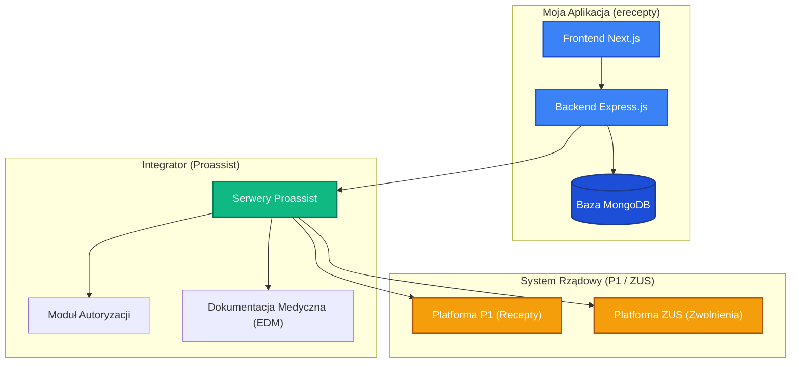

# Architektura Integracji: Moja Aplikacja vs Proassist API

Niniejszy dokument przedstawia graficzny podział odpowiedzialności pomiędzy Twoją aplikacją, zewnętrznym API Proassist a rządowym systemem P1 (e-zdrowie), a także kompletny proces przepływu danych od logowania do wystawienia e-recepty.

---

## 1. Podział Odpowiedzialności (Architektura)

Poniższy schemat obrazuje, za które elementy systemu odpowiada Twoja aplikacja (Frontend + Backend), a co jest delegowane do zewnętrznych podmiotów.



*   **Niebieski obszar (Twoja aplikacja):** Odpowiadasz za to w 100%. To tutaj projektujesz UI, zbierasz ankiety medyczne, autoryzujesz swoich użytkowników (lekarzy i pacjentów) i zapisujesz zgłoszenia lokalnie w bazie MongoDB.
*   **Zielony obszar (Proassist API):** Pośrednik (Proxy). Zamienia łatwe zapytania JSON z Twojego backendu na skomplikowane i zaszyfrowane komunikaty wymagane przez państwo.
*   **Pomarańczowy obszar (Systemy Rządowe):** Państwowe rejestry, w których ostatecznie musi zostać zarejestrowana każda recepta i zwolnienie lekarskie.

---

## 2. Diagram Sekwencji: Od Logowania do Odbioru Recepty

Poniższy diagram przedstawia pełny proces (krok po kroku) – od zalogowania się lekarza w Twoim panelu po odbiór leku przez pacjenta w aptece.

```mermaid
sequenceDiagram
    autonumber
    actor Pacjent
    actor Lekarz
    participant AppFront as Frontend (Next.js)
    participant AppBack as Backend (Node/Express)
    database MongoDB as Baza (MongoDB)
    participant Proassist as API Proassist
    participant SystemP1 as System P1 (e-zdrowie)

    Pacjent->>AppFront: Wypelnia formularz (PESEL, objawy, lek)
    AppFront->>AppBack: POST /api/patient/submissions
    AppBack->>MongoDB: Zapisz zgloszenie (status: pending)
    AppBack-->>AppFront: Potwierdzenie zgloszenia
    AppFront-->>Pacjent: Zgloszenie oczekuje na decyzje lekarza

    Lekarz->>AppFront: Loguje sie (email + haslo)
    AppFront->>AppBack: POST /api/auth/login
    AppBack->>MongoDB: Weryfikacja konta (rola: doctor)
    AppBack-->>AppFront: Zwrocenie JWT (sesja w naszej apce)
    Lekarz->>AppFront: Klika zatwierdz i wystaw recepte
    AppFront->>AppBack: PUT /api/patient/submissions/:id/status (approved)

    Note over AppBack, Proassist: Backend weryfikuje czy ma aktywny token Proassist
    opt Brak aktywnego tokenu
        AppBack->>Proassist: POST /api/auth
        Proassist-->>AppBack: Zwraca nowy Token JWT Proassist
    end

    AppBack->>Proassist: POST /api/edms (Tworzy EDM dla wizyty)
    Proassist-->>AppBack: Zwraca edmId

    AppBack->>Proassist: Zyczenie wystawienia recepty
    
    Note over Proassist, SystemP1: Podpisywanie recepty certyfikatem lekarza
    Proassist->>SystemP1: Wysyla e-recepte
    SystemP1-->>Proassist: Zarejestrowano! Zwraca packageCode (np. 9921)

    Proassist-->>AppBack: Zwraca packageCode 9921 i dane
    AppBack->>MongoDB: Zapisuje status approved i kod 9921

    AppBack-->>AppFront: Sukces
    AppBack->>Pacjent: Wysyla SMS / E-mail z kodem 9921
    
    Pacjent->>AppFront: Widzi kod 9921 w profilu
    
    actor Farmaceuta
    Pacjent->>Farmaceuta: Podaje PESEL + kod 9921
    Farmaceuta->>SystemP1: Pobiera e-recepte i wydaje lek
```

---

## 3. Kluczowe Wnioski dla Programisty

1.  **Dwie niezależne sesje autoryzacji:**
    *   **Lekarz <-> Twoja Aplikacja:** Używa JWT generowanego przez Twój backend. To zapewnia bezpieczeństwo dostępu do Twojej bazy MongoDB.
    *   **Twój Backend <-> Proassist API:** Używa osobnego tokenu JWT Proassist pobieranego w tle przy użyciu danych z pliku `.env`. Lekarz nie musi o tym wiedzieć.
2.  **Transakcyjność:** Jeśli rządowy system P1 leży (co się zdarza), zapytanie do Proassist zwróci błąd, a Ty cofasz transakcję w swojej bazie danych i wyświetlasz lekarzowi komunikat: *"Błąd komunikacji z platformą P1. Spróbuj ponownie za chwilę"*. Dzięki temu baza MongoDB zawsze odzwierciedla stan faktyczny.
